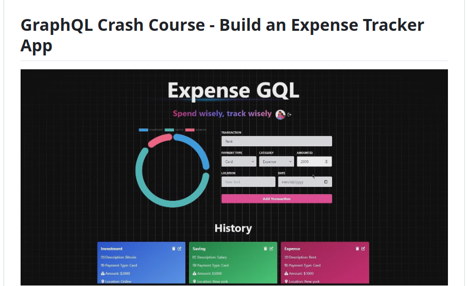

# MRN_project
this project client can track his or her expenditure plan using application
backend is intergrated by mongodb , graphql apollo server and express
to test working of app visit 
<a href="https://mrn-project.onrender.com "> Expesstracker</a>

 Build an Expense Tracker 

https://mrn-project.onrender.com/
Building Expense Tracker

🌟 Tech stack: MERN (MongoDB, Express.js, React.js, Node.js) + Apollo GraphQL
📝 Learn type definitions and resolvers for defining GraphQL schema and data fetching logic
🔄 Mutations for modifying data in the GraphQL API and establishing graph relations
🎃 Authentication with Passport.js and MongoDB session store
🚀 Global state management with Apollo Client
🐞 Error handling both on the server and on the client
⭐ Deployment made easy with a platform called Render
👾 Cron jobs for scheduled tasks and automation
⏳ And much more!
